# Project Camp — Architecture & Flow Diagrams

> Every diagram reflects the code in this repository: Express backend in `src/`, React frontend in `frontend/src/`.
> Mermaid renders on GitHub and in most Markdown previewers.

**Contents**

1. [Overall system architecture](#1-overall-system-architecture)
2. [Frontend execution flow](#2-frontend-execution-flow)
3. [Authentication flow (register, verify, login, reset)](#3-authentication-flow)
4. [Silent refresh flow](#4-silent-refresh-flow)
5. [Project flow](#5-project-flow)
6. [Task creation flow](#6-task-creation-flow)
7. [Task update flow (status / edit)](#7-task-update-flow)
8. [Subtask flow](#8-subtask-flow)
9. [Notes flow](#9-notes-flow)
10. [Members / invitation flow](#10-members--invitation-flow)
11. [Logout flow](#11-logout-flow)
12. [Backend middleware pipeline](#12-backend-middleware-pipeline)
13. [Data model](#13-data-model)
14. [Token & security architecture](#14-token--security-architecture)
15. [Key talking points](#15-key-talking-points)

---

## 1. Overall system architecture

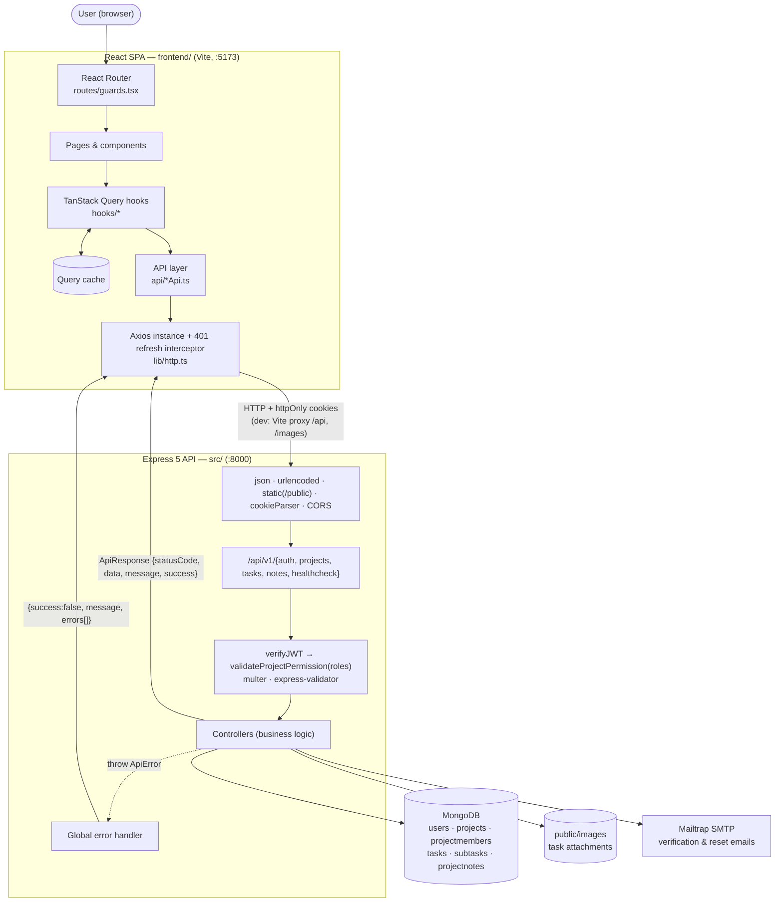

---

## 2. Frontend execution flow

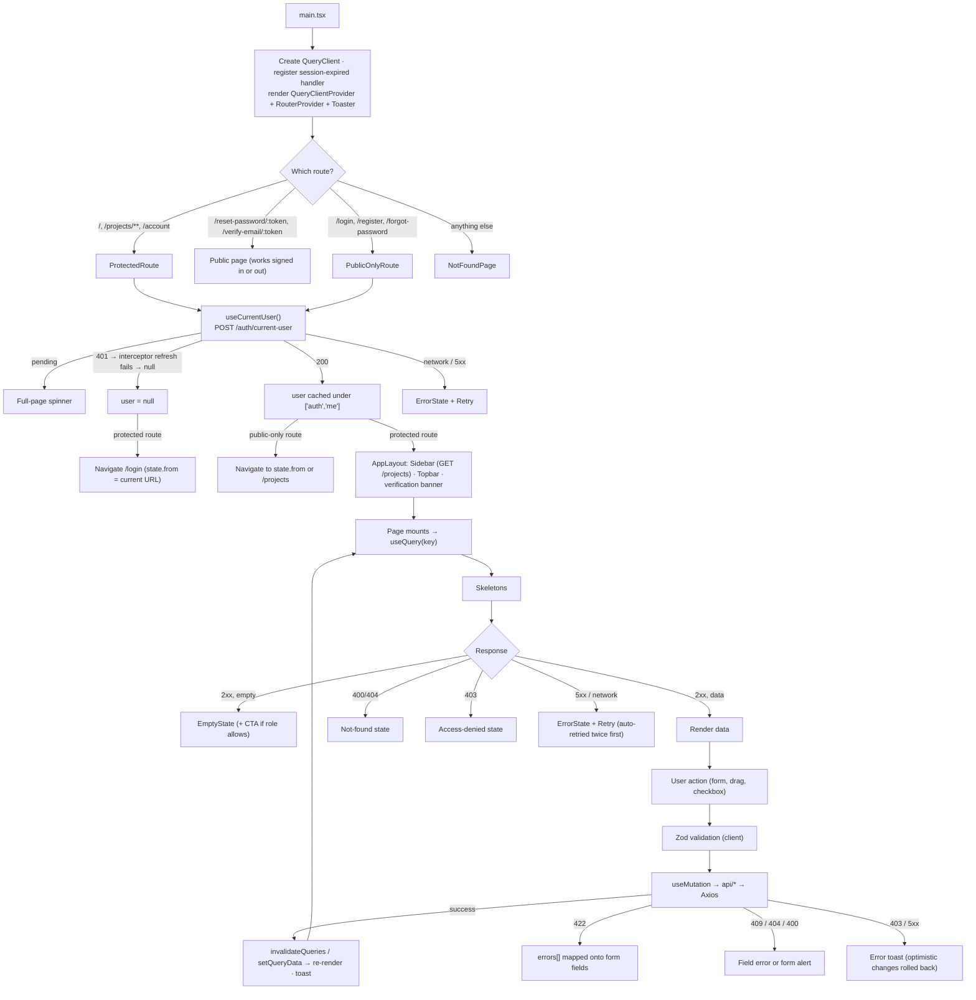

---

## 3. Authentication flow

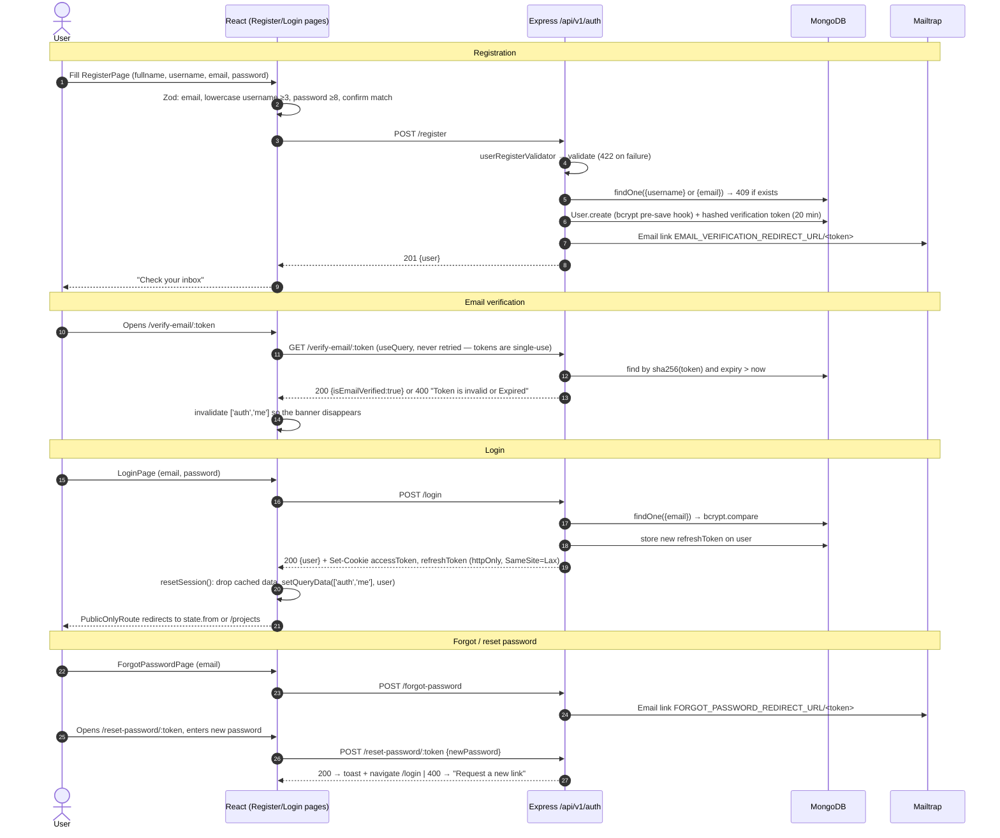

---

## 4. Silent refresh flow

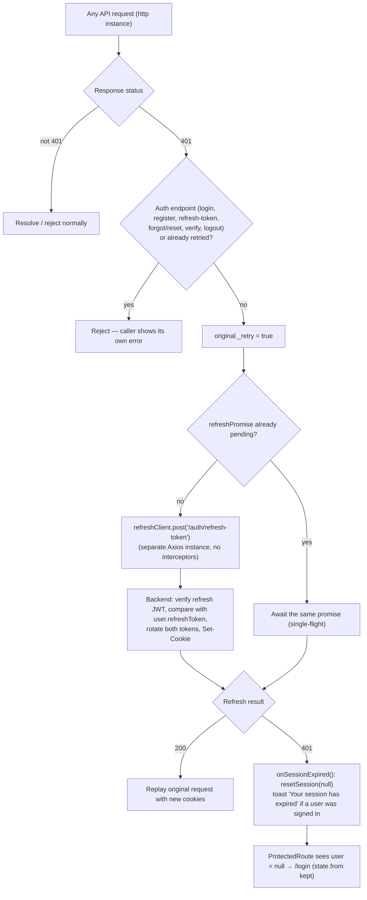

> Single-flight matters because the backend **rotates** refresh tokens: two parallel refreshes would send the
> same token twice, and the second would fail and log the user out.

---

## 5. Project flow

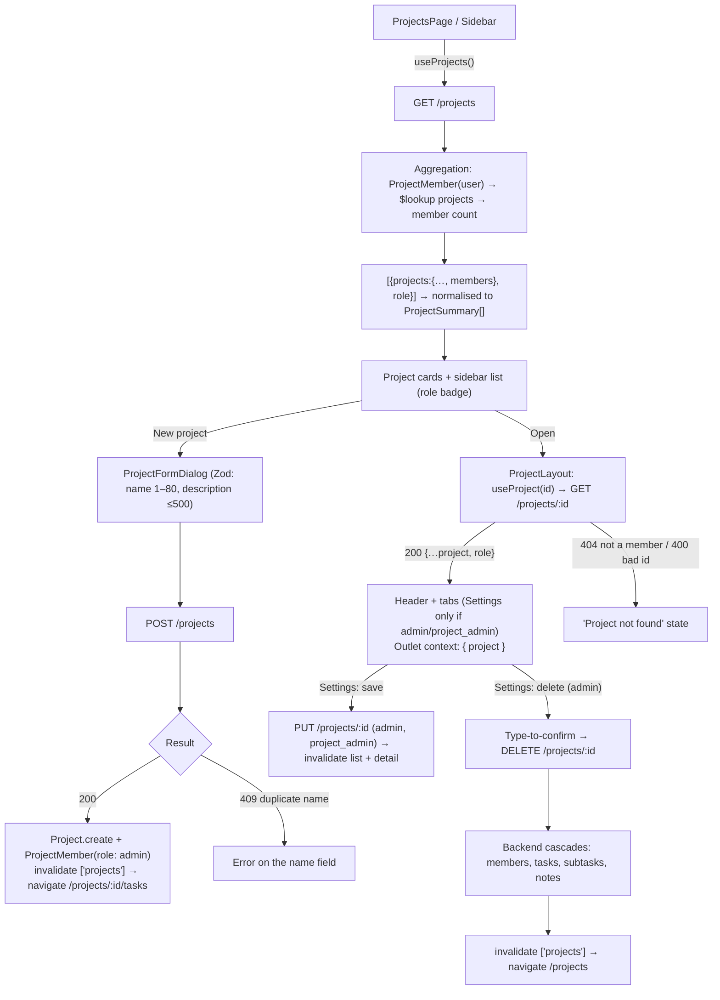

---

## 6. Task creation flow

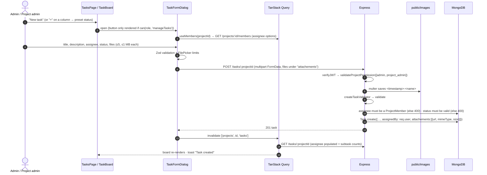

---

## 7. Task update flow

```mermaid
flowchart TD
    subgraph StatusChange["Status change (drag & drop on board or Status select in drawer)"]
        S1["onDrop / onChange (admin, project_admin only)"] --> S2["onMutate: cancel queries, snapshot,<br/>optimistically set status in list + detail caches"]
        S2 --> S3["PUT /tasks/:projectId/t/:taskId {status}"]
        S3 --> S4{"Response"}
        S4 -->|"200"| S5["Toast · invalidate tasks"]
        S4 -->|"error"| S6["Restore snapshots · error toast"]
    end

    subgraph Edit["Edit task (drawer → pencil)"]
        E1["TaskFormDialog prefilled from TaskDetail"] --> E2["PUT multipart: title, description,<br/>assignedTo ('' = unassign), status, new files"]
        E2 --> E3["Backend: task looked up by {_id, project} (404 if other project)<br/>assignee membership + status validated · new files appended"]
        E3 --> E4["invalidate ['projects', id, 'tasks'] (board + detail)"]
    end

    subgraph Delete["Delete task"]
        D1["ConfirmDialog"] --> D2["DELETE /tasks/:projectId/t/:taskId"]
        D2 --> D3["Backend deletes task {_id, project} + its subtasks"]
        D3 --> D4["Invalidate board · close drawer"]
    end
```

---

## 8. Subtask flow

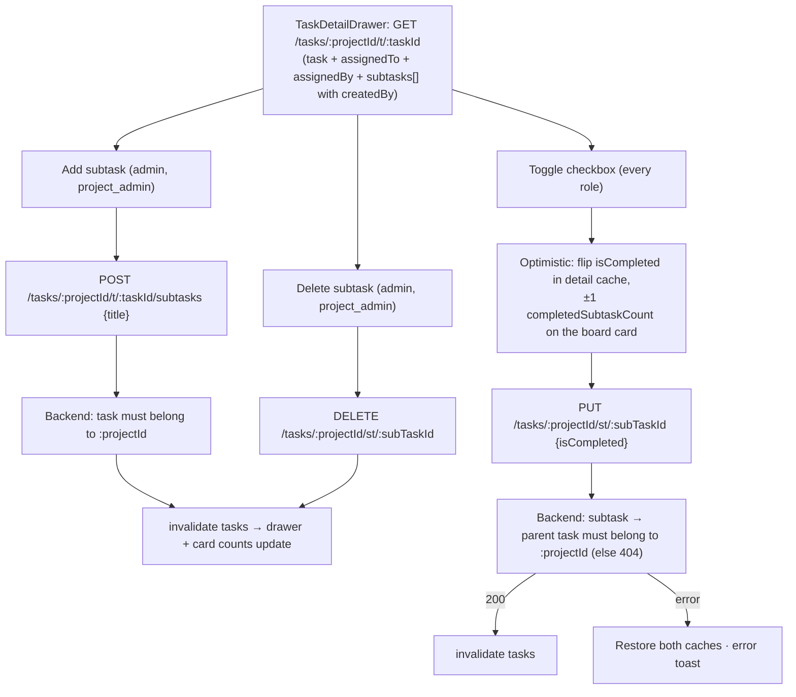

---

## 9. Notes flow

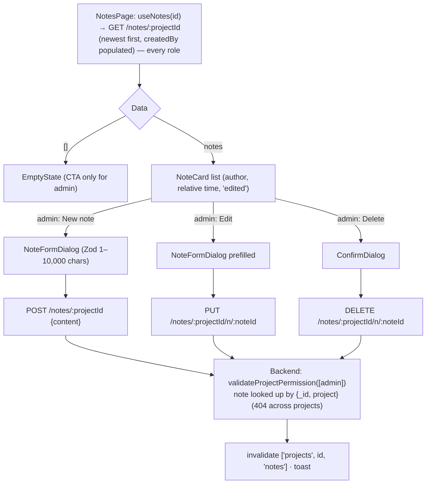

---

## 10. Members / invitation flow

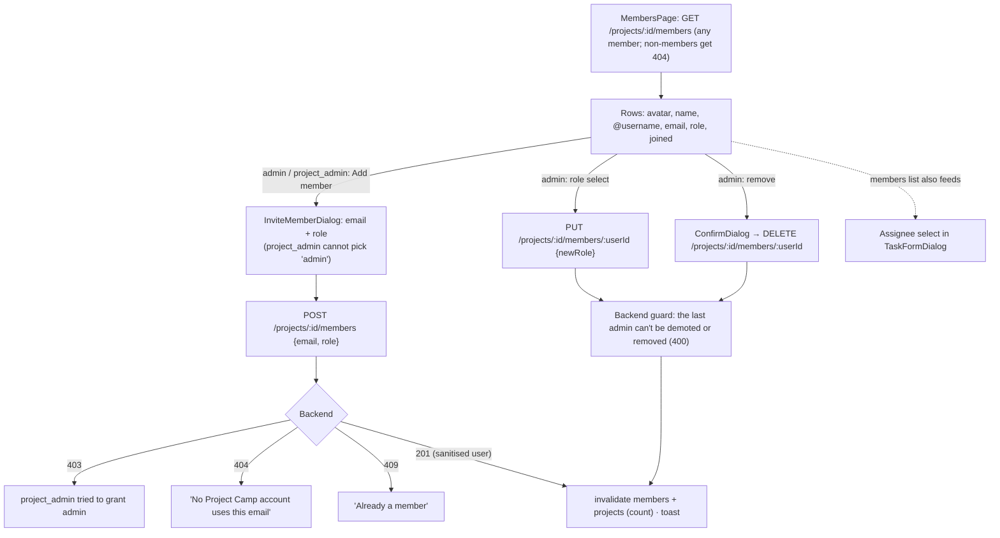

---

## 11. Logout flow

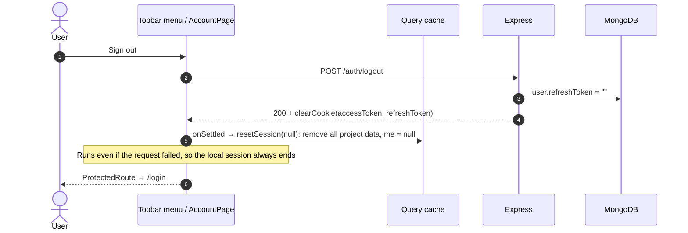

---

## 12. Backend middleware pipeline

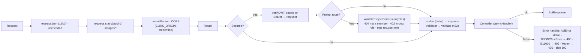

---

## 13. Data model

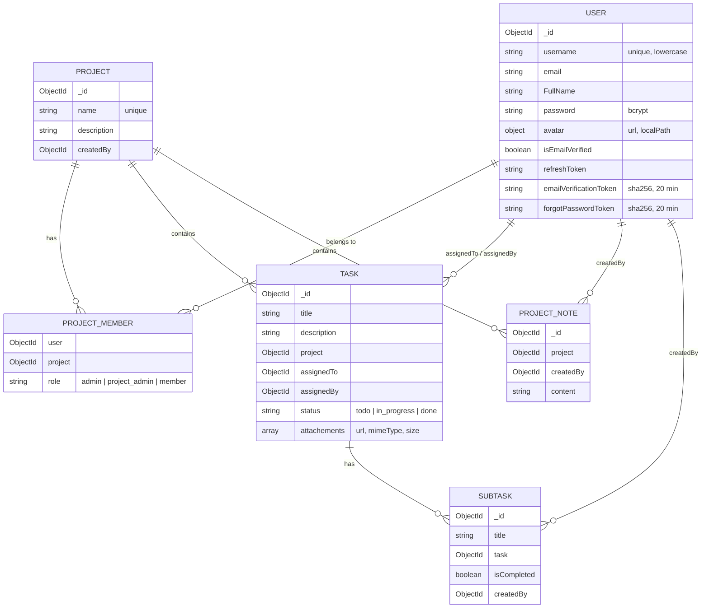

---

## 14. Token & security architecture

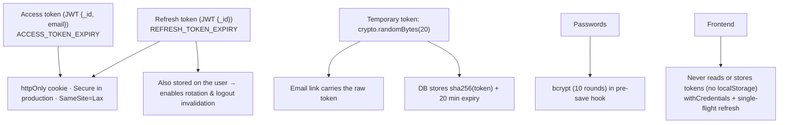

---

## 15. Key talking points

| Topic | Summary |
|---|---|
| **Architecture** | React SPA (Vite, TypeScript) → Axios → Express 5 REST API → MongoDB via Mongoose. In development the Vite proxy makes the API same-origin. |
| **Server state** | TanStack Query owns all server data: per-project cache keys, targeted invalidation, optimistic updates with rollback for status moves and subtask toggles. |
| **Authentication** | JWT access and refresh tokens in httpOnly cookies, refresh-token rotation, and a single-flight 401 → refresh → retry interceptor on the client. |
| **Authorization** | Per-project roles stored on `ProjectMember` and enforced by `validateProjectPermission`. The UI mirrors the same matrix (`lib/permissions.ts`), so users never see controls the API would reject. |
| **Data isolation** | Every task, subtask and note lookup is scoped to `:projectId`, so membership in one project can't reach another project's data (IDOR fix). |
| **Validation** | Zod on the client and express-validator on the server. Server 422 errors are mapped back onto the form fields. |
| **Error handling** | `ApiError` + `asyncHandler` + a global handler on the server. On the client, each status has its own UI: field errors, not-found, access denied, retry. |
| **Aggregation** | `$lookup` pipelines for project lists with member counts and task detail with populated users and subtasks. A `$group` adds subtask progress to the task board. |
